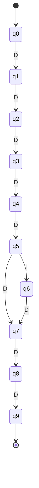

# LFA - Validacoes REGEX e Automatos

## Tabela de entradas validadas

| Dado validado | Expressao regular | Onde aparece |
|---|---|---|
| Placa Mercosul | `^[A-Z]{3}[0-9][A-Z][0-9]{2}$` | `RegexPatterns.PLACA_MERCOSUL`, DTO de veiculo e entidade `Veiculo`. |
| CPF ou CNPJ | `^(\d{3}\.?\d{3}\.?\d{3}-?\d{2}|\d{2}\.?\d{3}\.?\d{3}/?\d{4}-?\d{2})$` | DTO de ocorrencia e entidade `Ocorrencia`. |
| Telefone brasileiro | `^\(?\d{2}\)?\s?9?\d{4}-?\d{4}$` | Pontos, equipes e solicitante da ocorrencia. |
| CEP | `^\d{5}-?\d{3}$` | Pontos de atendimento. |
| Protocolo de ocorrencia | `^CID-\d{4}-\d{6}$` | Gerado pelo backend em `CodigoOperacionalFactory`. |
| Codigo de atendimento | `^ATD-\d{6}$` | Gerado pelo backend em `CodigoOperacionalFactory`. |

## Automato 1 - Placa Mercosul `AAA1A11`

Alfabeto simplificado: `L` representa letra maiuscula e `D` representa digito.


Estados de aceitacao: `q7`.

## Automato 2 - CEP `00000-000` ou `00000000`



Estados de aceitacao: `q9`.

## Automato 3 - Codigo de atendimento `ATD-000000`


Estados de aceitacao: `q10`.

## Trecho de codigo

```java
public static final String PLACA_MERCOSUL = "^[A-Z]{3}[0-9][A-Z][0-9]{2}$";
public static final String CPF_CNPJ = "^(\\d{3}\\.?\\d{3}\\.?\\d{3}-?\\d{2}|\\d{2}\\.?\\d{3}\\.?\\d{3}/?\\d{4}-?\\d{2})$";
```

As expressoes estao centralizadas em `backend/src/main/java/br/com/vitalis/cidalia/validation/RegexPatterns.java` e sao aplicadas com `@Pattern` nos DTOs e entidades.
