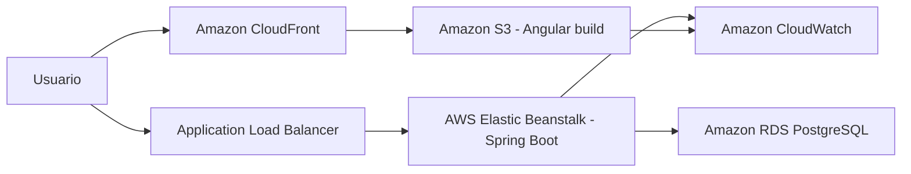

# Arquitetura AWS proposta

## Objetivo

Propor uma arquitetura simples, justificavel e coerente com o tamanho do Projeto Integrador, sem realizar deploy real.

## Desenho logico

## Servicos escolhidos

| Servico | Uso no projeto | Justificativa |
|---|---|---|
| Amazon S3 | Hospedar arquivos estaticos do Angular. | O frontend Angular gera arquivos estaticos em `dist/`, adequados para S3. |
| Amazon CloudFront | Distribuir o frontend. | Melhora entrega, HTTPS e cache para usuarios. |
| AWS Elastic Beanstalk | Publicar o backend Spring Boot. | Reduz configuracao manual de EC2, balanceador e ambiente Java. |
| Application Load Balancer | Entrada HTTP/HTTPS do backend. | Encaminha trafego para a aplicacao e permite health checks. |
| Amazon RDS for PostgreSQL | Banco relacional gerenciado. | Alinha com a escolha de Postgres e reduz manutencao do banco. |
| Amazon CloudWatch | Logs e metricas. | Apoia auditoria operacional e investigacao de falhas. |
| AWS Secrets Manager | Guardar senha do banco. | Evita expor credenciais em arquivo de configuracao. |

## Estimativa de custo mensal

Estimativa para ambiente academico pequeno, regiao `us-east-1`, baixo trafego e sem alta disponibilidade:

| Item | Configuracao assumida | Estimativa mensal |
|---|---|---|
| Elastic Beanstalk/EC2 | 1 instancia pequena para backend | US$ 8 a US$ 15 |
| RDS PostgreSQL | instancia pequena, Single-AZ, 20 GB | US$ 15 a US$ 25 |
| S3 | build Angular e poucos arquivos | abaixo de US$ 1 |
| CloudFront | baixo trafego | abaixo de US$ 2 |
| CloudWatch | logs basicos | US$ 1 a US$ 3 |
| Total aproximado | ambiente de demonstracao | US$ 25 a US$ 46/mes |

Observacao: os valores sao uma estimativa de estudo. Para entrega formal, a equipe deve reproduzir os itens na AWS Pricing Calculator usando a conta/regiao definida pelo professor.

## Fontes oficiais

- AWS Pricing Calculator: https://aws.amazon.com/aws-cost-management/aws-pricing-calculator/
- Guia da AWS Pricing Calculator: https://docs.aws.amazon.com/pricing-calculator/
- Elastic Beanstalk: https://aws.amazon.com/elasticbeanstalk/getting-started/
- Precos do Elastic Beanstalk: https://aws.amazon.com/elasticbeanstalk/pricing/
- Amazon RDS for PostgreSQL: https://aws.amazon.com/rds/postgresql
- Precos do Amazon RDS for PostgreSQL: https://aws.amazon.com/rds/postgresql/pricing/
- Precos do Amazon S3: https://aws.amazon.com/s3/pricing/

## Decisao de arquitetura

Para um projeto academico, Elastic Beanstalk foi escolhido em vez de Kubernetes ou ECS para manter o foco no sistema e na documentacao pedida. A solucao ainda mostra separacao entre frontend, backend, banco, monitoramento e seguranca de credenciais.
